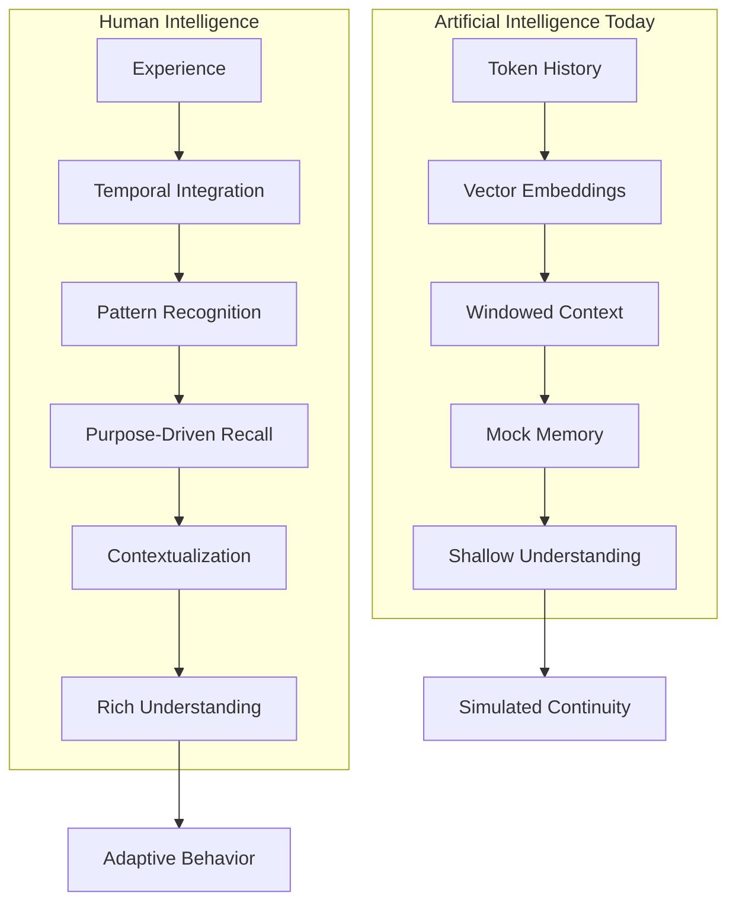

The term *memory* is thrown around liberally in the world of artificial intelligence, but it's often used to describe a shallow, and ultimately flawed, concept. Stuffing a vector database with document chunks or conversation history isn't memory—it's **mock memory**. It's a brute-force tactic for simulating continuity within the artificial boundaries of an LLM's context window. That window, despite growing in size, still functions as a volatile scratchpad—reset with each session, blind to temporal flow, and devoid of structural memory. At best, mock memory is a prosthetic. At worst, it's a crutch that masks a deeper absence of understanding.

Mock memory extends a model's context window, but it does not enable true recall. It offers snapshots of the past, unmoored from the meaning that gave those moments their significance. What it lacks is **integration**—the active, evolving synthesis of experience over time.

True memory, the kind that underpins human intelligence, is not about raw data retrieval. It's about actual **contextualization**. It's the capacity to answer the fundamental questions that drive understanding and adaptive behavior:

* **Who?** Who are the actors involved? What are their roles and relationships?
* **What?** What is the task? What are the goals, constraints, and objects of interest?
* **Why?** What is the underlying purpose? What motivates this action?
* **Where?** What is the environment? What is the scope of the system's knowledge and capabilities?
* **When?** What is the timeline? What events preceded this, and what must follow?
* **How?** What is the process? What are the steps, methods, and tools available?

A system that merely retrieves a text saying, “The user is working on Project X,” doesn’t *understand* that project. It doesn’t know that Project X is urgent, delayed, tied to a regulatory deadline, or that the user has expressed frustration with its current state. It doesn’t track the subtleties. It doesn't grow. It doesn’t **remember**.

Memory isn’t just knowing what happened. It’s knowing what matters—and why.

At Shadow Dynamic Systems, we are confronting this head-on. Our work on **hybrid memory meshes**—interlacing multiple strategies for storage, interpretation, prioritization, and feedback—is about moving past static recall. We are building systems that **model their world**, not just index it. Systems that **evolve**.

They learn from experience. They generalize patterns. They adapt strategies. They use principles like spaced reinforcement to highlight and revisit pivotal moments—without drowning in noise. These systems don’t just echo past words. They remember *what was learned*.

This is the difference between an AI that can answer a question, and one that can *solve a problem*. Between a tool that reacts, and a partner that **collaborates**. Between intelligence as simulation, and intelligence as **engagement**.

Stop calling it memory when it's only an echo. Stop building systems that impress instead of **comprehend**. Demand context. Demand systems that *remember like they mean it*.

